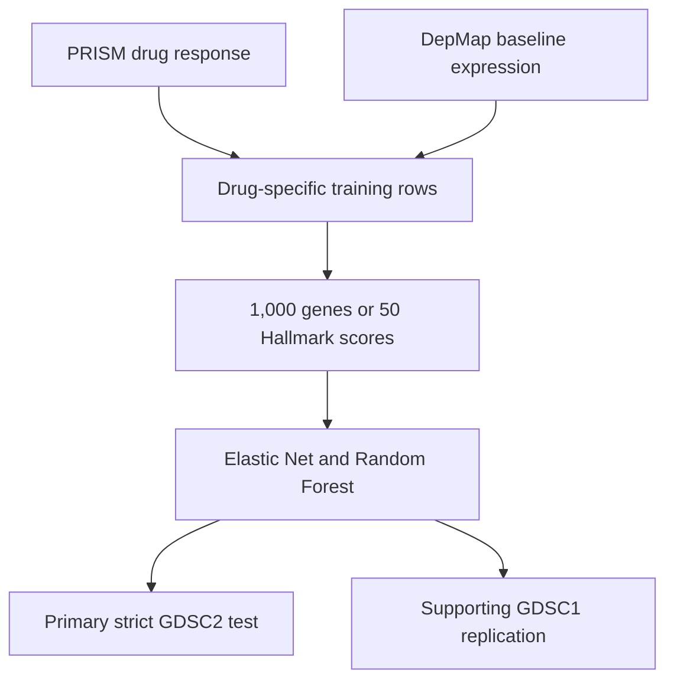
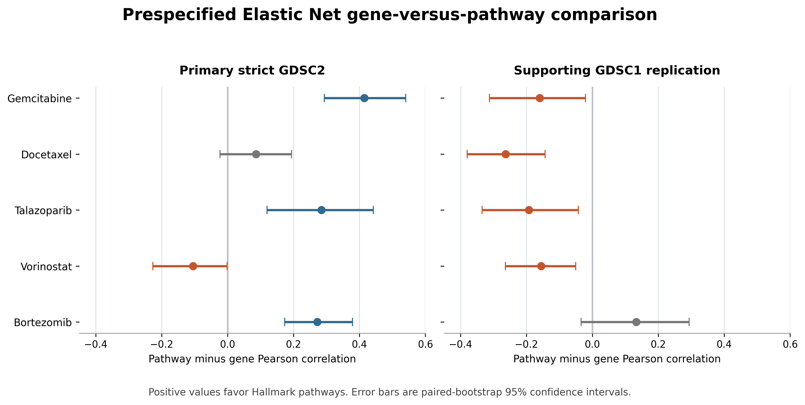

# Cross-dataset anticancer drug-response modeling

**A leakage-aware comparison of selected individual-gene and Hallmark-pathway representations trained with PRISM/DepMap and evaluated in GDSC.**

[](https://www.python.org/)
[](https://github.com/FranbonAhmed/cross-dataset-anticancer-drug-response/actions/workflows/tests.yml)
[](LICENSE)
[](#responsible-interpretation)

## Research question

Does compressing baseline cancer cell-line gene expression into 50 biologically defined Hallmark pathway scores improve cross-dataset drug-response prediction relative to 1,000 training-selected individual genes?

The project contains two deliberately separated stages:

1. **Exploratory pilot:** trametinib.
2. **Prespecified five-drug extension:** gemcitabine, docetaxel, talazoparib, vorinostat, and bortezomib.

The extension panel was frozen before its results were generated. All five drugs are reported, including uncertain and unfavorable comparisons.

## Study design



- One modeling row represents one cancer cell line.
- PRISM response is the training target; DepMap expression supplies predictors.
- `ModelID`/DepMap IDs join PRISM to DepMap, and `SANGER_MODEL_ID` joins GDSC response to Sanger expression.
- A DepMap-to-Sanger crosswalk excludes mapped training identities from strict external cohorts.
- `LN_IC50` is the primary external outcome; `AUC` is secondary.
- GDSC outcomes are used only after external predictions are generated.
- The prespecified primary comparison is the Elastic Net pathway-minus-gene Pearson correlation in strict GDSC2 Sanger-expression cohorts.

## Primary five-drug result

| Drug | Strict GDSC2 n | Gene r | Pathway r | Pathway − gene [95% CI] | Conclusion |
|---|---:|---:|---:|---:|---|
| Gemcitabine | 349 | -0.194 | 0.221 | +0.414 [+0.294, +0.540] | Pathways favored |
| Docetaxel | 351 | 0.134 | 0.220 | +0.086 [-0.023, +0.194] | Uncertain |
| Talazoparib | 347 | 0.086 | 0.371 | +0.284 [+0.120, +0.442] | Pathways favored |
| Vorinostat | 352 | 0.111 | 0.006 | -0.105 [-0.226, -0.002] | Genes favored |
| Bortezomib | 348 | -0.112 | 0.160 | +0.272 [+0.173, +0.379] | Pathways favored |



The corresponding GDSC1 comparisons favored genes for gemcitabine, docetaxel, talazoparib, and vorinostat; bortezomib was uncertain. The apparent GDSC2 pathway advantage therefore did **not** replicate across the second drug screen.

Across all 20 GDSC2 extension comparisons (five drugs × two models × Pearson/Spearman), eight favored pathways, six favored genes, and six were uncertain. Across the corresponding GDSC1 comparisons, 12 favored genes, eight were uncertain, and none favored pathways.

> **Conclusion:** feature-representation performance was drug-, model-, and dataset-dependent. These results do not support a universal claim that pathways or genes generalize better.

See [the complete multi-drug results](docs/MULTIDRUG_RESULTS.md), [methods](docs/METHODS.md), and [limitations](docs/LIMITATIONS.md).

## Quality-control summary

| Audit item | Verified result |
|---|---:|
| Completed extension drugs | 5 of 5 |
| Common DepMap–GDSC gene symbols | 19,204 for every drug |
| Genes selected inside PRISM training | 1,000 per model |
| Genes contributing to pathway scores | 4,374 |
| Hallmark pathways | 50 |
| Strict GDSC2 held-out models | 347–352 per extension drug |
| Strict GDSC1 held-out models | 191–339 per extension drug |
| Successful paired bootstraps | 1,000 per learned-model comparison |
| GDSC outcomes used during training | 0 |

## Repository map

```text
.
├── config/               Frozen extension panel
├── data/                 Provider download and placement instructions
├── docs/                 Methods, results, abstract, dictionary, and limitations
├── scripts/              Numbered analysis pipeline (00 through 13)
├── src/                  Reusable loading and modeling functions
├── tests/                Synthetic-pipeline and public-result checks
└── results/
    ├── audits/           Aggregate quality-control evidence
    ├── figures/          Final scientific figures
    └── tables/           Aggregate metrics and comparison tables
```

## Installation and verification

```bash
conda env create -f environment.yml
conda activate pharmacogenomics
pytest -q
```

The tests verify software behavior and committed aggregate results. They do not refit provider-controlled real data.

Follow [REPRODUCE.md](REPRODUCE.md) for the full workflow. To run or resume the frozen extension after placing the required data:

```bash
python scripts/13_run_prespecified_multidrug_extension.py --mode full --dry-run
python scripts/13_run_prespecified_multidrug_extension.py --mode full
```

## Data access

Raw DepMap, PRISM, GDSC, and MSigDB files are not redistributed. Obtain them from their providers and follow [data/README.md](data/README.md):

- [DepMap Data Portal](https://depmap.org/portal/data_page/)
- [PRISM Repurposing](https://depmap.org/repurposing/)
- [Genomics of Drug Sensitivity in Cancer](https://www.cancerrxgene.org/downloads/bulk_download)
- [Cell Model Passports downloads](https://cellmodelpassports.sanger.ac.uk/downloads)
- [MSigDB Hallmark gene sets](https://www.gsea-msigdb.org/gsea/msigdb/human/genesets.jsp?collection=H)

Users are responsible for each provider's license, access conditions, and citation requirements.

## Responsible interpretation

This is preliminary, non-peer-reviewed cell-line research. It does not predict patient benefit, establish causal biomarkers, or demonstrate clinical readiness. PRISM response and GDSC `LN_IC50`/`AUC` are different measurements, so external evaluation emphasizes correlation rather than cross-scale error. GDSC1 and GDSC2 also share biological models and should be interpreted as cross-screen evidence, not fully independent patient-like cohorts. Per-drug bootstrap intervals were not adjusted for multiple comparisons.

## Reproducibility and AI-assistance disclosure

The committed tables, figures, and audits are aggregate derived outputs. Row-level provider-derived outcomes and predictions are generated locally but excluded from the public repository.

Generative AI assisted with code drafting, debugging, documentation, and quality-control planning. The author executed the analyses, inspected the outputs, reconciled numerical claims against saved files, and accepts responsibility for the repository. Independent scientific review is still required.

## Author

**Franbon Ahmed Mohammed**  
MS in Business Analytics candidate, George Washington University  
[GitHub profile](https://github.com/FranbonAhmed)

## Citation

If you use this repository, cite the release described in [CITATION.cff](CITATION.cff). Dataset and gene-set providers must also be cited under their own terms.
